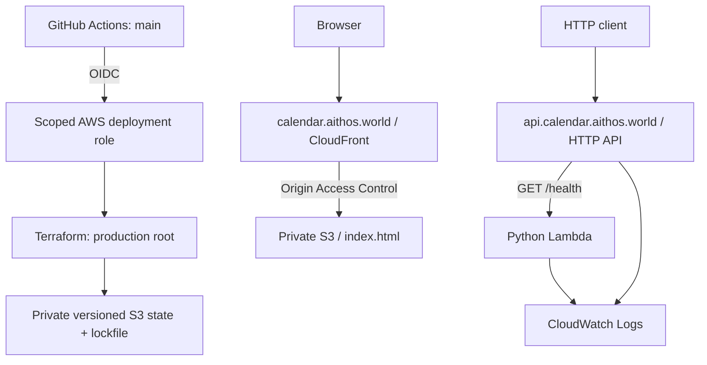

# Technical architecture

Status: stage 1 implementation prepared; deployment verification pending. Stage 1 is deliberately
limited to HTTP health, a blank static website, and production delivery.

## Confirmed choices

| Choice | Reason / boundary |
| --- | --- |
| One AWS production environment | No hosted development or staging infrastructure |
| Python Lambda, ZIP package | Standard library is sufficient for health |
| API Gateway HTTP API | Small public HTTP surface; no REST API features needed |
| Terraform | Own AWS resources, certificates, DNS records, and static object |
| GitHub Actions on `main` | One delivery path with serialized deployment |
| GitHub OIDC to AWS | Temporary credentials; no stored AWS access keys |
| S3 remote Terraform state with native locking | Durable state without a DynamoDB locking table |
| Private S3 + CloudFront for website | Static hosting with HTTPS on the requested domain |
| Direct HTTP availability adapter, later | Proven read path; isolate the undocumented Google protocol |
| Anakin booking adapter, later | Chosen booking provider; live behavior remains to be validated |

The earlier handoff excluded CloudFront when describing an API-only foundation.
The current requirement adds an AWS-hosted HTTPS static site. Use CloudFront for
that site only; do not put it in front of the API.

## Stage 1 topology



### API

- Primary region: `eu-west-3`, as configured for `aithos-prod`.
- Python `3.14`, currently a supported stable Lambda runtime; verify availability
  again when implementing. `x86_64`, 128 MB memory, 5-second timeout initially.
- Standard-library handler with an API Gateway payload v2 response.
- One public route: `GET /health`.
- HTTP 200, `Content-Type: application/json`, body:

  ```json
  {"status":"ok","service":"calendar"}
  ```

- Health is a liveness check; it performs no network or provider calls.
- `$default` stage with auto deployment, root custom-domain mapping, no catch-all
  application route. Unsupported routes return 404 through API Gateway.
- Disable the default execute-api endpoint after configuring the custom domain.
- Lambda invoke permission limited to this API and health route.
- Terraform-managed log groups with 14-day retention; API access logs retain
  operational identifiers/status, not request bodies, tokens, or calendar links.
- No CORS yet: the blank website makes no API calls.

### Website

- One S3 bucket distinct from the Terraform state bucket.
- Block public access; use the S3 REST origin and CloudFront Origin Access Control.
- Bucket policy grants reads only to the project's CloudFront distribution.
- Serve a minimal valid `index.html` with an empty body, page title, and no scripts,
  forms, framework, analytics, or application assets.
- Terraform uploads the object with `text/html; charset=utf-8` and content hash.
- CloudFront default root object is `index.html`; redirect HTTP to HTTPS.
- Disable caching for this initial document to avoid adding an invalidation step.
  Revisit cache policy when real assets exist.
- No SPA routing fallback yet; no application routes exist.

### DNS and certificates

- Reuse the existing authoritative public zone for `aithos.world` after verifying
  its account, zone ID, and delegation. Never create a duplicate zone as a shortcut.
- API: regional ACM certificate in `eu-west-3`, API Gateway custom domain, Route 53
  alias at `api.calendar.aithos.world`.
- Website: ACM certificate in `us-east-1` for CloudFront, alternate domain
  `calendar.aithos.world`, Route 53 A/AAAA aliases.
- Automate certificate DNS validation with Terraform. Touch only the two requested
  names and required validation records; inspect collisions before applying.

## Terraform organization and ownership

Use two small root configurations, with no reusable Terraform modules yet:

- `infra/bootstrap`: state bucket, GitHub OIDC integration, deployment role/policy,
  and the narrowly scoped Lambda execution role. Run only with the operator's AWS
  profile. Reuse an existing account-wide GitHub OIDC provider without taking
  ownership of or modifying other projects' provider configuration.
- `infra/production`: Lambda, logs, HTTP API, both domain certificates/records,
  CloudFront, private website bucket, and its single static object.

Bootstrap and production have separate state keys in the same encrypted,
versioned, private S3 bucket. Enable `use_lockfile = true`. Production CI cannot
write bootstrap state, modify its own trust/permissions, or change execution-role
permissions. Pass the execution-role ARN as non-secret configuration; allow
`iam:PassRole` only for that role and only to Lambda.

The deployment policy grants the actions necessary for the listed production
resources, scoped by ARN, name, tag, region, DNS record, and service conditions
where supported. Document API operations which require wildcard resources.
Do not substitute AdministratorAccess to make a failed deployment succeed.

Bootstrap initially uses ignored local state to create its backend, then migrates
that state into `bootstrap/terraform.tfstate`. Production always initializes
against `production/terraform.tfstate`; Actions must never use ephemeral local
state. The detailed bootstrap sequence is part of the stage 1 plan.

Protect the state bucket from accidental destruction and do not force-delete
nonempty buckets. Secrets are never Terraform variable values or managed secret
contents. There are no application secrets at stage 1.

## Delivery

One workflow, triggered by pushes to `main`; no PR deployment or
`pull_request_target` execution. Permissions: `contents: read`, `id-token: write`.
Use a single concurrency group with `cancel-in-progress: false`.

Sequence: checkout -> install pinned Terraform -> assume deployment role using
OIDC -> initialize remote backend -> noninteractive apply -> publish target URLs
in the job summary. Terraform builds the Lambda ZIP through `archive_file` and
wires its hash to `source_code_hash`; no Docker or separate build service.

Resolve supported provider versions during implementation, commit dependency
lockfiles, and use the same pinned Terraform CLI version locally and in CI.
Pin third-party Actions to reviewed full commit SHAs.

OIDC trust must match the exact repository, immutable IDs when applicable,
`refs/heads/main`, and audience `sts.amazonaws.com`. New GitHub repositories can
use a subject format containing owner/repository IDs: inspect the actual policy
format at creation rather than copying an older trust-policy example.
Do not add a GitHub Environment without adjusting the subject policy.

No unit-test, lint, PR-validation, matrix, release, or staging pipeline at stage 1.
Use manual end-to-end acceptance after deployment. A successful workflow is not
by itself proof that the service works on its final domains.

## Future application boundaries — design only

Keep a small Python application with explicit injected dependencies, not a
plugin framework or a collection of microservices:

| Boundary | Responsibility |
| --- | --- |
| HTTP handlers | Input/output and operation status |
| Scheduling application | Candidate selection and booking orchestration |
| `AvailabilityReader` | Normalized page metadata and available intervals |
| `BookingProvider` | Submit a booking and retrieve its authoritative outcome |
| Repository | Persist share links and durable operations when needed |
| A2A transport | Expose discovery/tasks using the same application logic |

Provider adapters own Google URLs, JSON/protobuf field positions, public client
configuration, Anakin credentials, job IDs, and provider error translation.
Core scheduling uses timezone-aware instants, intervals, a host-defined duration,
and normalized outcomes. Replacing a reader or booking provider should not change
the product handlers or scheduling rules.

Do not use equal visitor and host durations as a matching requirement. Validate
full-interval availability and the limitations recorded in the product design.
Constrain accepted URL hosts and redirects before any server-side fetch.

Anakin uses asynchronous jobs. API Gateway HTTP API has a maximum 30-second
integration timeout, so the eventual booking request should return an operation
ID promptly and expose status polling. Add persistence and a durable execution
mechanism when implementing booking; do not leave a Lambda running after its
HTTP response or keep an HTTP request waiting for the entire booking.
Before enabling writes, resolve vendor idempotency, ambiguous submission outcomes,
identity, email verification, and the visitor calendar's actual busy state.

At the A2A stage, multiple logical agents share this infrastructure. Generate
Agent Cards from validated server configuration and map each agent to its own
resources. A2A discovery does not prove page ownership or grant permission to
book for someone. One designated organizer creates one booking. No A2A SDK,
registry integration, database, worker, or LLM is installed for health.

## Explicitly absent from stage 1

Application DynamoDB, Anakin account/secret, OAuth, Google calendar access,
booking operations, SQS, Step Functions, EventBridge jobs, VPC/NAT, containers,
ECR, layers, framework, SDK A2A, LLM, application authentication, and product UI.
Reevaluate ZIP packaging only when real Python dependencies are introduced.

## Sources checked during planning

- [Lambda runtimes](https://docs.aws.amazon.com/lambda/latest/dg/lambda-runtimes.html)
- [HTTP API quotas](https://docs.aws.amazon.com/apigateway/latest/developerguide/http-api-quotas.html)
- [API regional domains](https://docs.aws.amazon.com/apigateway/latest/developerguide/apigateway-regional-api-custom-domain-create.html)
- [CloudFront HTTPS certificates](https://docs.aws.amazon.com/AmazonCloudFront/latest/DeveloperGuide/cnames-and-https-procedures.html)
- [S3 origin access control](https://docs.aws.amazon.com/AmazonCloudFront/latest/DeveloperGuide/private-content-restricting-access-to-s3.html)
- [Terraform S3 state and locking](https://developer.hashicorp.com/terraform/language/backend/s3)
- [GitHub OIDC with AWS](https://docs.github.com/en/actions/how-tos/secure-your-work/security-harden-deployments/oidc-in-aws)
- [Anakin appointments](https://anakin.io/catalog/google_appointments)
