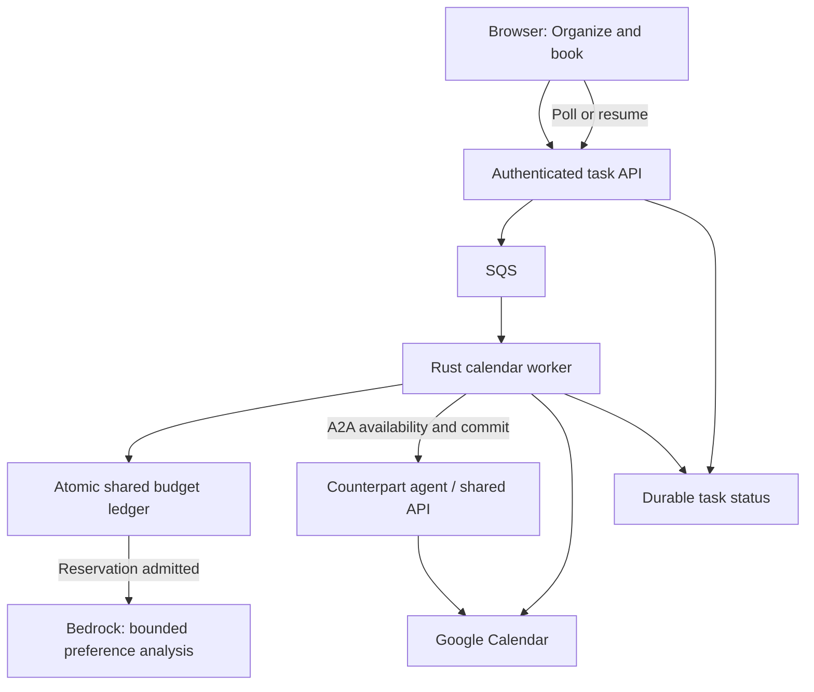

# Autonomous calendar agent — V0

## User contract

On `/account` or a connected agent's sharing link, **Organize and book** authorizes
one meeting. The server chooses the time and duration, rechecks both calendars,
creates the organizer's event, and accepts the guest invitation. No second
confirmation is required. The browser polls a durable task and can resume after
reload. The existing booking operation ID is reused through every recovery; an
uncertain write never leads to a new event ID or blind resubmission.

Existing public booking-page/Anakin routes are unchanged.

## Data and decisions

- Primary calendar only; existing owned-events OAuth scope.
- Nine months back and three months forward; at most eight pages of 1,000 Google
  events. Incomplete history falls back, never silently biases learning.
- Free/busy remains authoritative. Calendar text is untrusted model input.
- Exclude cancelled, declined, transparent, all-day and non-default event types
  from preference evidence. They still affect free/busy when Google marks them busy.
- Match the peer by their authenticated Google email, never a guessed name.
- Collapse each recurring series to one observation; pass up to 60 distinct recent
  observations (prioritizing the peer) to the model. Titles/descriptions are bounded.
- The model returns a bounded JSON preference profile. Each learned feature needs
  at least three distinct past observations referenced by real event IDs. This is
  an evidence heuristic, not proof of subjective preference.
- Profiles and the requester's last 20 meetings with the peer are cached privately
  for 24 hours. The counterpart's event titles are never returned to the requester.
- Defaults: 30 minutes, weekdays 09:00–18:00, excluding 12:00–14:00. Search starts
  tomorrow in **both** calendar time zones, within the next 30 days. Learned lunch
  flexibility and 45/60-minute durations require evidence.
- Generate candidates on a 15-minute grid. Maximize the worse of the two preference
  scores, then their sum, then prefer the earliest time. Reject busy intervals.
- Missing history, unavailable model, invalid JSON, missing ledger or exhausted
  budget automatically select deterministic defaults. Authorization failures and
  unknown booking outcomes remain visible; they are not represented as success.

The shared Rust worker prepares each private profile. It then discovers the host
through the catalog/card and calls the host through the official A2A SDK. The host
returns its availability and bounded preference fields; the requesting agent
selects the mutual compromise. `commit_booking` still goes through authenticated
A2A. This V0 has one exchange, without an open-ended LLM conversation.

## Execution




`POST /calendar/tasks` requires a session, same-origin request, host URL and client
UUID. The account and UUID derive one task/booking ID. Retrying the same request is
idempotent; reusing the UUID for a different host is rejected.
`GET /calendar/tasks/{id}` returns private status only to that account.

SQS invokes a separate 240-second Lambda running the same Rust binary. A durable
300-second compare-and-swap lease prevents concurrent workers processing a task.
The browser is not the execution engine. Pending bookings are automatically
reconciled with bounded retries, then reported as needing attention. Terminal
job records expire after 30 days; unresolved jobs and the budget have no TTL.

## Budget invariant and scope

**This is application admission control, not an AWS contractual invoice cap.**
It covers all inference performed by this application, including operator model
probes. It excludes infrastructure, taxes, other applications and direct calls by
AWS administrators. Provider billing/pricing correctness and trusted deployed
code/IAM administration are assumptions; tests cannot prove those external facts.

The configured ceiling is USD 30 per UTC calendar month. The compiled operating
ceiling is **USD 25**, leaving a USD 5 margin. No API, user input, environment
variable or LLM output can raise it.

All amounts are integer **nanodollars**. One strongly consistent DynamoDB record
contains the current UTC month, completed maximum charges and unresolved holds.
An atomic revision check admits an invocation only when:

```
spent + sum(unresolved holds) + maximum next-call charge <= 25,000,000,000
```

The pinned model is `eu.anthropic.claude-haiku-4-5-20251001-v1:0`, using standard
text inference from Paris through the EU profile. Its documented entire context
is 200,000 tokens. Every call reserves that FULL input bound plus the enforced
1,024 output-token cap, even for much smaller prompts. This deliberately avoids
relying on approximate token counting or endpoint-specific counting support.
No thinking, caching, tools, guardrails, routing, priority tier or paid add-ons
are enabled. A prompt over 48,000 UTF-8 bytes is rejected before invocation.

The ledger rates are $1.375/M input and $6.875/M output, 25% above the published
EU $1.10/$5.50 rates verified September 17, 2026. Thus **each call reserves
$0.28204**, limiting a fresh monthly ledger to 88 such calls. Actual AWS charges
will usually be far lower. This is intentionally conservative for V0.

A completed invocation consumes its full maximum; there is **no refund API**.
A timeout, cancellation, lost response or invalid usage keeps the hold indefinitely,
including in subsequent months. Finishing a hold moves the same maximum into the
completion month's spent amount. Duplicate completion cannot replenish allowance.
Clock regression, corrupt/missing state, overflow, CAS uncertainty or an oversized
unresolved ledger block inference. A successful CAS with a lost response does not
permit a model call. Bedrock SDK retries are disabled and tested against HTTP 503.

Prices require review before **2026-10-17 UTC**. After that date inference fails
closed and scheduling uses defaults until a reviewed deployment updates the tariff.
The ledger must NEVER be reset to make the model available. Restoring an old backup
also requires reconciliation of all later charges before re-enabling inference.

Bootstrap owns the protected table. Its initial seed was written once during
rollout, then detached from Terraform state without deleting the live record.
Routine bootstrap applies therefore cannot recreate a missing ledger at zero. A
missing record requires operator reconciliation before any manual recovery; it
never means a fresh budget. Runtime roles cannot delete the ledger; API and deployment roles cannot invoke Bedrock. API writes are restricted
to `job:*` keys. Only the worker can call the one allowed inference profile.

## Bedrock account setup

The account needs the Anthropic first-use form and the metered model agreement
for `anthropic.claude-haiku-4-5-20251001-v1:0`, enabled once by the operator.
These were requested for this project on September 17, 2026. The runtime does
not receive Marketplace subscription permissions. No provisioned capacity is
configured. See [AWS model-access setup](https://docs.aws.amazon.com/bedrock/latest/userguide/model-access.html).

Check `get-foundation-model-availability` before probing: agreement,
authorization, entitlement and regional availability must be ready. The inference
profile being `ACTIVE` alone does not prove that account onboarding is complete.
The initial deployment also encountered the account's minimum unreserved Lambda
concurrency; the worker uses SQS maximum concurrency two without a Lambda reserved
concurrency allocation. Budget admission is atomic independently of concurrency.

## Verification

- `cargo test --locked`: concurrent reservations, overflow, missing/corrupt ledger,
  month rollover, ambiguous commit, lost inference response, duplicate settlement,
  actual SDK retry behavior, scheduling evidence, A2A numeric round trips, durable
  booking recovery, and authenticated task isolation/idempotence.
- `python3 scripts/with-env.py python3 scripts/test-budget-dynamodb.py`:
  creates its own temporary table, runs 80 concurrent reservations through the
  production DynamoDB adapter, asserts exactly 25 admissions at $1 each, checks
  duplicate settlement and rejection at the ceiling, then deletes the test table.
  No Bedrock invocation and no production ledger mutation.
- `python3 scripts/with-env.py python3 scripts/check-agent-permissions.py`:
  read-only IAM simulation of the budget and inference access boundaries.
- An operator can invoke the worker with `{"operation":"verify_model"}` to test
  real Bedrock using synthetic data. This is charged against the SAME ledger;
  there is no public diagnostic route and no calendar read or booking.

## Manual acceptance

1. Sign in at `/account`; connect Calendar if necessary.
2. Paste the other connected person's Aithos agent link.
3. Press **Organize and book** once. This action really books a meeting.
4. Wait for the result, or reload: the same task resumes.
5. Check the time, duration, two calendar copies and previous-meetings section.
6. Inspect CloudWatch for `llm_authorized`, `preference_fallback`, the A2A SDK
   request/response events and `connected_booking_outcome`. Calendar content and
   OAuth tokens must never be logged.

References: [Haiku model limits](https://docs.aws.amazon.com/bedrock/latest/userguide/model-card-anthropic-claude-haiku-4-5.html),
[AWS budget limitations](https://docs.aws.amazon.com/cost-management/latest/userguide/bcm-lite-use-budget.html),
[Google events.list](https://developers.google.com/workspace/calendar/api/v3/reference/events/list).

### Operator allowance check

```sh
python3 scripts/with-env.py python3 scripts/budget-status.py
```

This reads the real shared ledger and displays completed maximum charges,
unresolved holds and remaining allowance. It does not issue an inference or
modify the counter. `examples/history_probe.rs` separately verifies the live
Google history adapter with explicitly configured test account IDs and prints
counts only; it does not call Bedrock or book a meeting.

## Acceptance evidence — 2026-09-17

- Local full suite: 73 passing tests, two opt-in legacy Google network tests
  ignored; the added strict JSON-response test also passes (74 tests total).
- Real DynamoDB adapter: 80 simultaneous $1 reservations admitted exactly 25.
  A further nanodollar was rejected, including after duplicate completion.
  The isolated test table was deleted; the production ledger was untouched.
- IAM simulation verifies that the API/deployment roles cannot invoke Bedrock or
  modify the budget; the worker can invoke only the configured inference profile.
- A bootstrap Terraform plan after real inference reports **no changes**, proving
  that routine application of this configuration preserves the used ledger.
- Live Google history reads succeeded for both configured test accounts; only
  aggregate counts were printed. No real meeting was created for verification.
- Browser fixtures verified success with learned duration, previous meetings,
  reload during processing and no shared slot.
- Production commit `573d064`: [CI run](https://github.com/Math1987/aithos-calendar/actions/runs/35211394470)
  passed all 74 tests and deployment smoke checks. The worker is Active with a
  successful update, and its SQS mapping is Enabled with maximum concurrency two.
- Budget seed ownership was detached with a reviewed Terraform `forget` action
  (`destroy = false`). The live DynamoDB item was identical before and after,
  and the seed is absent from Terraform state: routine bootstrap cannot reset a
  missing record by creating a new zero-value seed.
